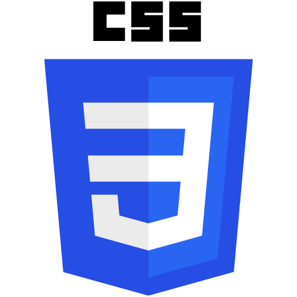
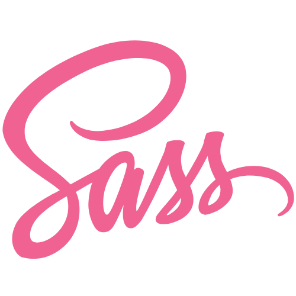
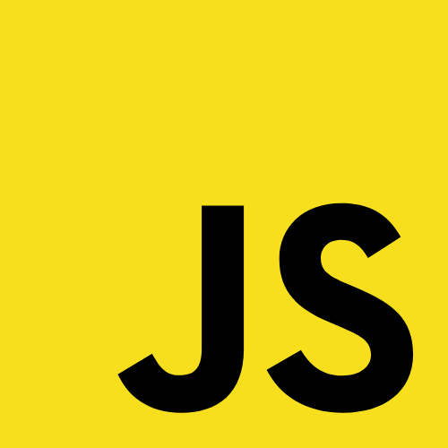
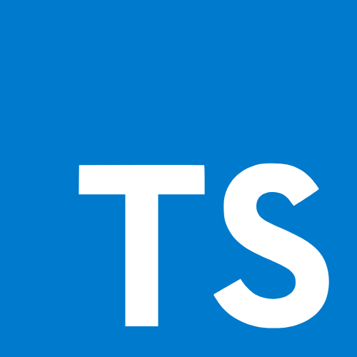
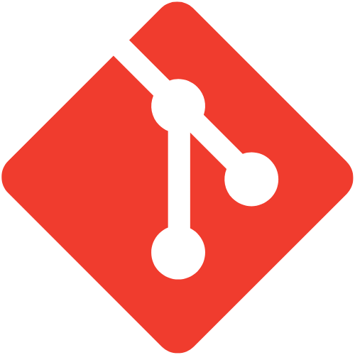
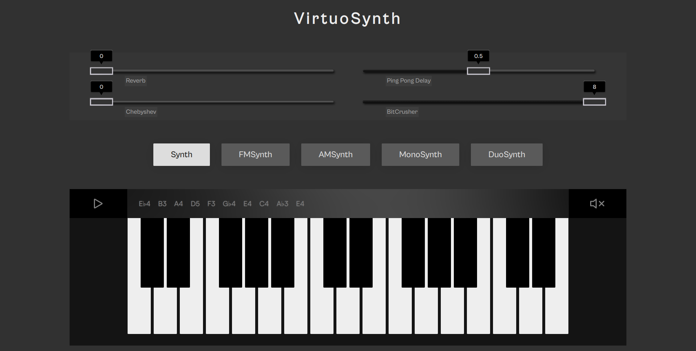
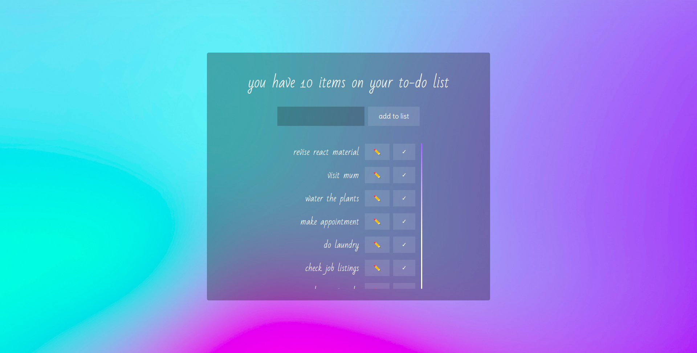

## Hi 👋

I'm Kakai Wapenyi, a full stack web developer currently living in Berlin. 
 

Aside from coding, i'm also very passionate about art 🎨, music (both discovery & production) 🎶, sustainability 🌳 and intercultural awareness 🧑🏿‍🤝‍🧑🏻, and am always looking for opportunities to indulge multiple interests at a go.
 
 

🔧 Technologies & Tools

 

 

  
:zap: Github Stats

   
  

 

  
:zap: Languages Used

   
  

 

  
:zap: Sneak Peak of my work

   

  VirtuoSynth             |  To-Do App
:-------------------------:|:-------------------------:
  |  

## 📫 Contact

